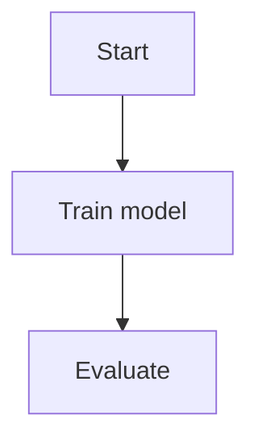
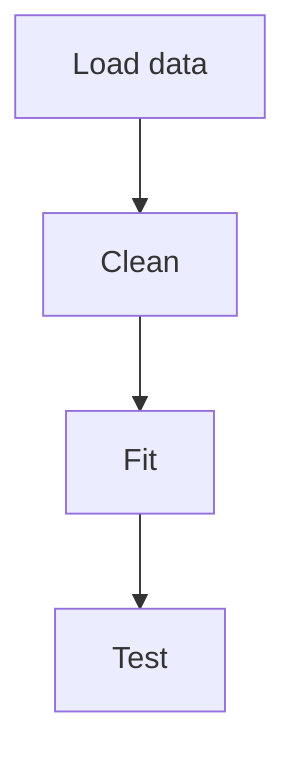
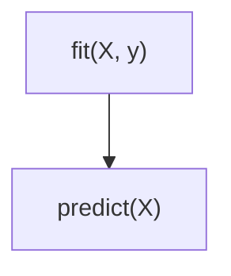
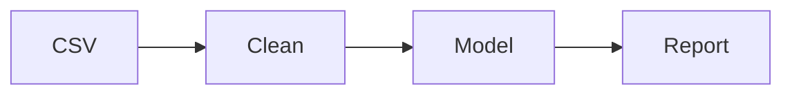
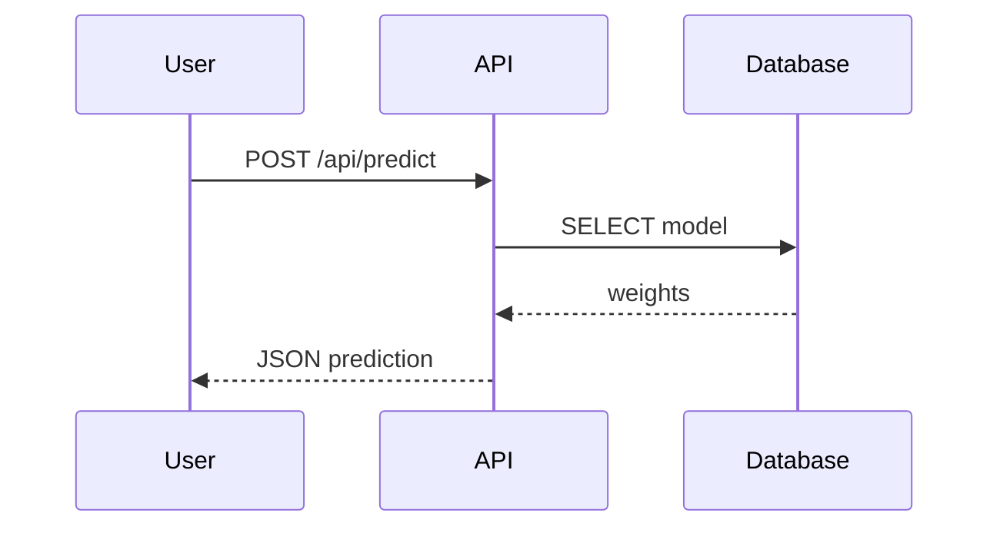
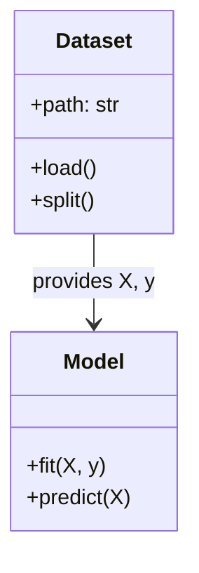

# Lesson 21 — Mermaid diagrams

[← Previous Lesson](20-math.md) | [Course Home](../README.md) | [Next Lesson →](22-gfm.md)

---

## Learning objectives

By the end of this lesson you will be able to:

- Embed a Mermaid diagram in GitHub-Flavored Markdown
- Draw a flowchart, a sequence diagram, and a class diagram
- Keep node labels valid (no raw line breaks; quote special characters)
- Know that Mermaid is **renderer-dependent**
- Choose Mermaid versus an image export

## Conceptual explanation

**Mermaid** is a text language for diagrams. You write a description; a JavaScript library draws SVG.

On **GitHub**, a fenced block tagged `mermaid` becomes a diagram in Markdown files, issues, and many wikis.

````markdown

````

This is **not** standard Markdown. VS Code may need an extension. Pandoc needs a filter. If the renderer does not support Mermaid, readers see the source code — which is still better than a binary file you cannot diff.

**Why students use it**

- Architecture sketches next to the code
- ML pipelines (data → features → model → metrics)
- Protocol / API sequence diagrams
- Class diagrams for software projects

## Syntax

A Mermaid fence:

````markdown

````

### Syntax explanation

- The language tag must be `mermaid`.
- The first line inside chooses a diagram type: `graph` / `flowchart`, `sequenceDiagram`, `classDiagram`, `stateDiagram-v2`, `erDiagram`, `gantt`, `pie`, etc.
- Nodes have IDs (`A`) and labels (`[Load data]`).
- Arrows (`-->`) connect nodes.
- **Do not put line breaks inside a label.** Keep labels on one line.
- If a label contains parentheses, brackets, or other special characters, wrap the label in double quotes.

Correct:



Incorrect (special characters may break parsing):

```text
A[fit(X, y)] --> B[predict(X)]
```

## Beginner example

````markdown

````

**Expected rendered result on GitHub**

Four boxes in a left-to-right flow, connected by arrows.

**If Mermaid is unsupported**

The fenced source appears as a code block. You can still read the pipeline.

## Intermediate example: sequence diagram for an API lab

````markdown

````

**Expected rendered result**

A vertical-lifeline diagram of a prediction request. Excellent in backend course reports.

## Advanced example: class diagram and styling limits

````markdown

````

**Expected rendered result**

Two classes and a relationship.

GitHub restricts some Mermaid features for security (certain directives, `click` handlers, and some styling). Keep diagrams simple. Do not rely on interactive `click` to run JavaScript.

### Mermaid versus PNG/SVG in git

| Mermaid in Markdown | Exported image |
|---------------------|----------------|
| Diffable text | Binary or large SVG |
| Renders on GitHub | Works everywhere as `` |
| Limited styling | Full control in draw.io / matplotlib |
| Breaks on old tools | Portable |

A robust approach for a thesis: keep Mermaid in GitHub notes; export SVG for the PDF.

## Common mistakes

- Line breaks inside node labels (this course forbids them; Mermaid often fails).
- Unquoted `()`, `[]`, `{}` in labels.
- Using `graph` directions incorrectly (`TD` top-down, `LR` left-right).
- Assuming README CSS can restyle Mermaid freely on github.com.
- Enormous diagrams that overflow a phone screen. Split them.
- Putting Mermaid inside a list without indenting the fence (Lesson 09).

## Best practices

- One diagram, one idea.
- Short quoted labels.
- ASCII IDs (`A1`, `trainLoop`) and human labels in brackets.
- Provide a one-sentence caption under the fence, like a figure.
- Offer a PNG fallback in `assets/` if some readers use a non-GitHub viewer.

## Practical use cases

- **Software README:** architecture flowchart
- **ML project:** data pipeline
- **Databases course:** ER diagram (`erDiagram`)
- **OS / networks:** sequence of packets
- **Team process:** issue → PR → review → merge

## Practice exercises

1. Draw a flowchart of your morning routine with four nodes (`flowchart TD`).
2. Quote a label that contains `train(X)`.
3. Convert a short client–server conversation into a `sequenceDiagram`.
4. Write a caption paragraph under the diagram as you would for a report figure.

## Quick review

- GitHub: fenced `mermaid` blocks render as diagrams
- Not standard Markdown
- Keep labels on one line; quote special characters
- Prefer simple graphs; caption them in prose
- Use images when you need portability or custom design

---

[← Previous Lesson](20-math.md) | [Course Home](../README.md) | [Next Lesson →](22-gfm.md)
