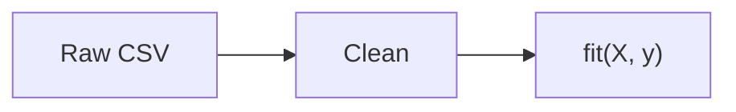

# Lesson 33 — Advanced Markdown techniques

[← Previous Lesson](32-accessibility.md) | [Course Home](../README.md) | [Next Lesson →](34-professional-examples.md)

---

## Learning objectives

By the end of this lesson you will be able to:

- Combine features professionally in one document
- Use reference links, snippets, and TOCs at scale
- Embed diagrams, math, and tables without chaos
- Apply HTML details, alerts, and badges with restraint
- Design multi-file documentation as a system

## Conceptual explanation

Advanced Markdown is rarely new syntax. It is **composition**: choosing the right block for each idea and connecting files into a navigable whole.

An expert document feels quiet. Headings tell the story. Code is copyable. Warnings are visible. Optional material is folded. Links work.

This lesson stitches together everything from Lessons 01–32.

## Technique catalog

### 1. Reference-link blocks at the bottom

Keep prose clean in literature-heavy notes.

```markdown
We follow the evaluation in Smith et al.[^smith] and the API in the
[official client][client].

[client]: https://example.com/api
[^smith]: Smith et al., 2024, DOI:10.0000/xyz
```

### 2. Progressive disclosure

```markdown
> [!NOTE]
> Beginners: start with [Quick start](../lessons/24-readme-files.md).

<details>
<summary>Full CLI reference</summary>

| Flag | Meaning |
| ---- | ------- |
| `--seed` | RNG seed |

</details>
```

### 3. Single-source examples

Do not invent different commands on different pages. Define one canonical snippet in `docs/install.md` and link it.

### 4. Diagram + caption + fallback

````markdown

````

**Figure 2.** Training pipeline.

If you need print: also save `assets/pipeline.png`.

### 5. Math in methods, code in appendix

Display the equation, then the implementation. The first sample is **intentionally wrong** (the `$$` block is closed with a Markdown fence). Do not copy it.

The correct pairing uses `$$` to close math, then a separate Python fence:

````markdown
$$
\text{MSE} = \frac{1}{n}\sum_{i=1}^{n}(y_i - \hat{y}_i)^2
$$

```python
mse = ((y - y_hat) ** 2).mean()
```
````

Unclosed math or fences are the advanced author's most expensive typo.

## Beginner-to-expert example: one section done three ways

**Beginner**

```markdown
## Results

Accuracy was 0.91.
```

**Intermediate**

```markdown
## Results

| Split | Accuracy |
| ----- | -------: |
| Test  |     0.91 |
```

**Expert**

```markdown
## Results

Test accuracy was **0.91** (n = 200, seed 0).

| Split | Accuracy | Macro F1 |
| ----- | -------: | -------: |
| Train |     0.96 |     0.95 |
| Test  |     0.91 |     0.90 |


**Figure 1.** Most errors are class 2 predicted as class 1.

> [!WARNING]
> This seed is **not** the production model. See [limitations](#limitations).
```

The expert version is still Markdown. It is just complete.

## Intermediate example: multi-file navigation system

This course's pattern:

```markdown
[← Previous](32-accessibility.md) | [Home](../README.md) | [Next →](34-professional-examples.md)
```

Rules that make it work:

- Every file exists
- Names are stable
- Home is always `../README.md` from `lessons/`
- First lesson omits Previous; last lesson omits Next (or points to exercises)

Use the same pattern in `docs/`.

## Advanced example: includes are not standard

Some tools support:

```markdown

```

or `::include` or MDX imports.

**Those are not Markdown.** They are generator features. If you use them, your GitHub file view may show raw tags. Expert authors either:

- Avoid includes on GitHub-first docs, or
- Generate Markdown before commit

Do not paste Jekyll includes into a student lab that the TA will read on github.com unless Pages is the true target.

### Comments

```html
<!-- TODO: add GPU install notes -->
```

HTML comments are omitted from rendering on GitHub. They still appear in the source and in clones. Do not hide secrets in comments.

## Common mistakes

- Every advanced feature on one page (badge wall + five Mermaid graphs + alerts on every paragraph)
- Includes that only work in one static generator
- TOC that is stale
- Mixing tabs in nested lists after copying from Slack
- "Expert" documents that skip alt text

## Best practices

- Compose simple blocks
- Hide optional material; never hide required material
- Keep a working navigation skeleton
- Treat unclosed fences as a ship-blocker
- Prefer duplication of a *short* command over a broken include
- Re-read the rendered GitHub page, not only the source

## Practical use cases

- This curriculum
- Large open-source manuals
- Research group handbooks
- Capstone documentation sets (your final project)

## Practice exercises

1. Upgrade a one-sentence Results section to the expert pattern (table + figure caption + warning).
2. Add previous/home/next lines to two fictional docs pages.
3. Write a `<details>` block that contains a table, with blank lines so GitHub parses the table.
4. Search a real README for generator-only syntax (``, MDX). Would it look correct on github.com?

## Quick review

- Advanced Markdown is composition and systems, not secret characters
- Reference links, details, alerts, diagrams, math — each has a job
- Navigation must point at real files
- Includes and MDX are not portable GitHub Markdown
- Restraint is the expert skill

---

[← Previous Lesson](32-accessibility.md) | [Course Home](../README.md) | [Next Lesson →](34-professional-examples.md)
