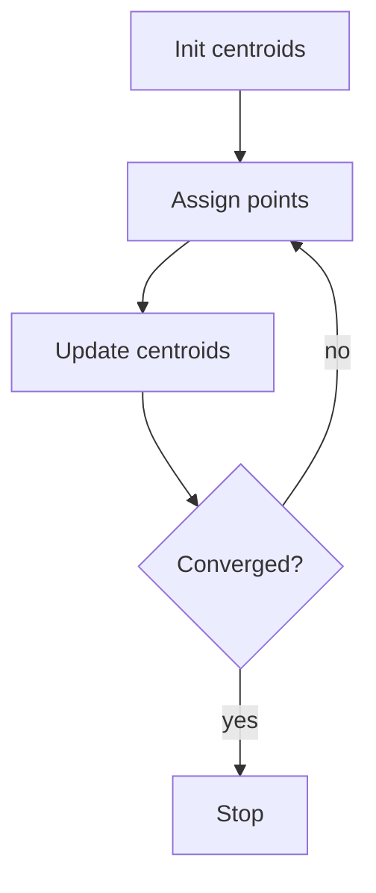

# Lesson 34 — Professional documentation examples

[← Previous Lesson](33-advanced-markdown.md) | [Course Home](../README.md) | [Next Lesson →](../exercises/README.md)

---

## Learning objectives

By the end of this lesson you will be able to:

- Read a professional Markdown document and name the techniques it uses
- Adapt annotated templates for README, lab report, API reference, and meeting notes
- Combine GFM features without overusing them
- Move from examples to your [final project](../projects/final-project.md)

## Conceptual explanation

The following examples are **complete enough to steal as templates**. Comments in prose (not in the Markdown) tell you *why* each block exists.

They mix:

- Standard Markdown (headings, lists, links, emphasis, fences)
- GFM (tables, tasks, strikethrough)
- GitHub extras (alerts, badges) labeled as such

Copy, then delete what your project does not need.

---

## Example A — Open-source README (annotated)

````markdown
# riverflow

[](LICENSE)

Measure seasonal river discharge from public gauge CSVs.

## Why this exists

Field courses needed a **one-command** summary that does not require a GIS license.

## Features

- Reads USGS-style daily CSV
- Writes a summary table and a PNG hydrograph
- Pure Python 3.12

## Installation

```bash
pip install riverflow
```

## Quick start

```bash
riverflow summarize gauges/sample.csv --out results/
```

## Documentation

- [Usage](docs/usage.md)
- [CSV columns](docs/data-format.md)

## Contributing

See [CONTRIBUTING.md](CONTRIBUTING.md).

## License

[MIT](LICENSE)
````

**What to notice**

- H1 is the product name
- One-sentence pitch immediately
- Badge is an image link (GitHub-friendly, optional)
- Install and quick start are copyable
- Deep content is linked, not dumped
- License matches the badge

---

## Example B — Machine-learning lab report

````markdown
# Lab 5: Regularized logistic regression

**Course:** DS 320\
**Authors:** N. Patel, L. Gómez\
**Date:** 5 April 2026

## Abstract

We compared unregularized and L2-regularized logistic regression on a
2,000-row click-through dataset. L2 improved test log-loss from 0.41 to 0.37.

## Introduction

Overfitting appears when the feature space is wide relative to n.

## Methods

### Data

Stratified 80/20 split, seed 0. Categorical features used one-hot encoding.

### Models

| Model | `C` | Solver |
| ----- | --: | ------ |
| Unregularized | 1e9 | `lbfgs` |
| L2 | 1.0 | `lbfgs` |

### Metric

$$
\ell = -\frac{1}{n}\sum_i \left[y_i\log p_i + (1-y_i)\log(1-p_i)\right]
$$

## Results


**Figure 1.** L2 is better calibrated in the upper decile.

## Discussion

Regularization helped because several one-hot columns were rare.

## Limitations

- One seed
- No hyperparameter search beyond the default `C`

## References

1. Hastie, Tibshirani, Friedman. *The Elements of Statistical Learning*.
````

**What to notice**

- IMRaD headings
- Line breaks in the title block (`\`)
- Small results table
- Math only where it earns its place
- Figure with alt text and caption
- Limitations are visible, not hidden in a footnote

---

## Example C — API / CLI reference page

````markdown
# `riverflow summarize`

## Synopsis

```bash
riverflow summarize INPUT.csv --out DIR [--window DAYS]
```

## Arguments

| Name | Required | Description |
| ---- | -------- | ----------- |
| `INPUT.csv` | yes | Daily discharge file |
| `--out DIR` | yes | Output directory |
| `--window DAYS` | no | Rolling mean window (default 7) |

## Exit codes

| Code | Meaning |
| ---: | ------- |
|    0 | Success |
|    2 | Usage error |
|    3 | Parse error in CSV |

## Example

```bash
riverflow summarize gauges/sample.csv --out results/ --window 14
```

## See also

- [data format](data-format.md)
````

**What to notice**

- Reference tone: short, tabular, no story
- Identifiers in backticks
- See also for navigation

---

## Example D — Meeting notes / research log

```markdown
# 2026-04-21 Lab meeting

- **Present:** Amina, Theo, Sam
- **Goal:** freeze features for the midterm demo

## Decisions

- Use `scikit-learn` pipeline, not a custom scaler
- Freeze random seed at 0 for the demo only

## Action items

- [x] Theo: upload cleaned CSV
- [ ] Amina: baseline F1 by Friday
- [ ] Sam: README quick start screenshot

## Next meeting

28 April 2026
```

**What to notice**

- Date in the H1 so files sort
- Decisions separate from actions
- Task list is GFM and appropriate here

---

## Example E — Course notes snippet with diagram

````markdown
# k-means in one page

## Algorithm



**Figure 1.** Lloyd's algorithm.

## Complexity

Per iteration roughly $O(n k d)$ for n points, k clusters, d dimensions.

## See also

[Nested lists lesson](09-nested-lists.md) if you outline variants as a tree.
````

**What to notice**

- Quoted Mermaid labels because of `?` and `()`
- Caption after the fence
- Inline math for a bound, not a screenshot of a slide

---

## How to study these examples

1. Predict the rendered outline from headings alone.
2. Mark each feature: standard, GFM, GitHub-only, renderer-dependent.
3. Delete one section and see whether the document still answers the reader's first question.
4. Reuse the skeleton in the [final project](../projects/final-project.md).

## Common mistakes when copying templates

- Leaving `OWNER/REPO` and `example.com` unreplaced
- Keeping every section even when empty
- Mixing lab-report formality with README badges in a graded PDF
- Forgetting to add the real `figures/` files

## Best practices

- Templates are starting points, not padding
- Match tone to genre (README vs report vs reference)
- Every example command should be one you could run
- Link to the next document

## Practice exercises

1. Fork Example A and replace riverflow with your last homework.
2. Add a GitHub `WARNING` alert to Example B about data licensing (GitHub-only).
3. Convert Example D's action items into an issue-style task list with assignees as text (not necessarily `@mentions`).
4. Start the [final project](../projects/final-project.md).

## Quick review

- Professional Markdown is mostly structure and honesty
- READMEs sell and instruct; reports argue with evidence; reference pages tabulate
- Label flavor-specific features when you teach or share templates
- You are ready for exercises and the capstone

---

**Next:** [Exercises](../exercises/README.md) · [Final project](../projects/final-project.md) · [Cheat sheet](../resources/cheat-sheet.md)

---

[← Previous Lesson](33-advanced-markdown.md) | [Course Home](../README.md) | [Exercises →](../exercises/README.md)
